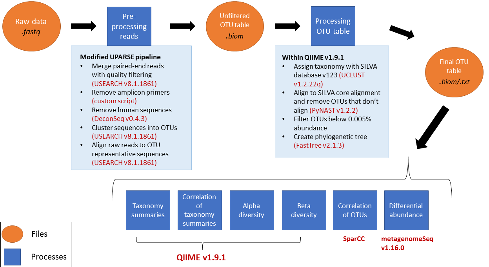

```{r setup, include=FALSE}
knitr::opts_chunk$set(echo = F, message = F, warning = F)
```


Soucre: [userach V11](https://drive5.com/usearch/manual/)

Source: [16S rRNA analysis by R.Lappan](https://rachaellappan.github.io/16S-analysis/)



<br>

**Common Workflow:**

  - Pre-processing reads
      - quality filtering
      - Remove amplicon primers
      - Remove human sequences
      - Cluster sequences into OTUs
      - Align raw reads to OTUs
  - Pre-processing OTU table
      - Filter out OTUs below 0.005% abundance
  - Exploring Taxonomy
      - Taxonomy Summaries (relative abundance)
      - Abundance Correlation (OTU abundance between treament/sample)
  - Alpha diversity
  - Beta diversity 
  - Differential Abundance (investigate what makes these microbiomes distinct: which bacteria are differentially abundant between groups)
  - Correlation between OTUs (especially between differentially abundant bacteria of interest)  
      - [SparCC](https://journals.plos.org/ploscompbiol/article?id=10.1371/journal.pcbi.1002687). 
      - The issue with correlations between bacteria in microbiome data is that the data is compositional; it describes the relative abundance of bactera, not absolute like if you were to determine bacterial load with qPCR. Each OTU contributes a proportion of reads that add up to 100% in each sample. The problem with searching for correlations here is that if there is an increase in one OTU, all of the other OTUs must decrease, and this ends up looking like a negative correlation between the increased OTU and everything else when this may not be the case.
      - A tool called SparCC determines correlations between OTUs taking this specific problem into account.
  - Correlation between OTUs and meta-data.  


